# PostgreSQL Database Schema

## Entity Overview

| Entity | Purpose |
|---|---|
| `languages` | Supported languages (Spanish, French, etc.) |
| `word_categories` | Grammatical categories: verb, noun, adjective… |
| `grammar_rules` | A grammar pattern template (source-language canonical name/description) |
| `grammar_rule_translations` | Translations of grammar rule name and description by language |
| `grammar_rule_rows` | Row slots of a grammar rule table (e.g. person/number positions) |
| `grammar_rule_row_translations` | Translations of grammar rule row labels by language |
| `base_words` | A word in its canonical/dictionary form (e.g. hablar) |
| `word_translations` | Translations of base words by language |
| `word_rule_assignments` | Which grammar rule tables a base word belongs to |
| `word_forms` | A specific inflected form generated for a row (e.g. hablo) |
| `word_form_translations` | Translations of generated word forms by language |
| `topics` | Semantic categories used for practice selection |
| `topic_translations` | Translations of topic name/description by language |
| `expressions` | Study units that are not connected to grammar rules |
| `expression_translations` | Translations of expressions by language |
| `base_word_topics` | Topic tagging for base words |
| `expression_topics` | Topic tagging for expressions |
| `sentences` | Reusable source-language templates with blanks |
| `sentence_translations` | Translations of sentence templates by language |
| `word_form_sentences` | Which sentence a word form uses |
| `entity_embeddings` | Centralized embeddings for semantic search across entities |

---

## ER Diagram

```mermaid
erDiagram

    languages {
        uuid id PK
        varchar code
        varchar name
    }

    word_categories {
        uuid id PK
        varchar name
        varchar slug
    }

    grammar_rules {
        uuid id PK
        varchar name
        text description
        uuid language_id FK
        uuid word_category_id FK
    }

    grammar_rule_translations {
        uuid id PK
        uuid grammar_rule_id FK
        uuid language_id FK
        varchar name
        text description
    }

    grammar_rule_rows {
        uuid id PK
        uuid grammar_rule_id FK
        varchar label
        int position
    }

    grammar_rule_row_translations {
        uuid id PK
        uuid grammar_rule_row_id FK
        uuid language_id FK
        varchar label
    }

    base_words {
        uuid id PK
        varchar text
        uuid language_id FK
        uuid word_category_id FK
    }

    word_translations {
        uuid id PK
        uuid base_word_id FK
        uuid language_id FK
        varchar text
    }

    word_rule_assignments {
        uuid id PK
        uuid base_word_id FK
        uuid grammar_rule_id FK
    }

    word_forms {
        uuid id PK
        uuid word_rule_assignment_id FK
        uuid grammar_rule_row_id FK
        varchar value
    }

    word_form_translations {
        uuid id PK
        uuid word_form_id FK
        uuid language_id FK
        varchar text
    }

    topics {
        uuid id PK
        varchar name
        text description
        uuid language_id FK
    }

    topic_translations {
        uuid id PK
        uuid topic_id FK
        uuid language_id FK
        varchar name
        text description
    }

    expressions {
        uuid id PK
        varchar text
        uuid language_id FK
    }

    expression_translations {
        uuid id PK
        uuid expression_id FK
        uuid language_id FK
        varchar text
    }

    base_word_topics {
        uuid base_word_id FK
        uuid topic_id FK
    }

    expression_topics {
        uuid expression_id FK
        uuid topic_id FK
    }

    sentences {
        uuid id PK
        text template
        uuid language_id FK
        uuid word_category_id FK
        uuid grammar_rule_id FK
        int row_position
    }

    sentence_translations {
        uuid id PK
        uuid sentence_id FK
        uuid language_id FK
        text template
    }

    word_form_sentences {
        uuid id PK
        uuid word_form_id FK
        uuid sentence_id FK
    }

    entity_embeddings {
        uuid id PK
        varchar entity_type
        uuid entity_id
        uuid language_id FK
        varchar model_name
        int dimensions
        vector embedding
        text source_text
        timestamp created_at
        timestamp updated_at
    }

    languages ||--o{ grammar_rules : has
    languages ||--o{ grammar_rule_translations : translation_language
    languages ||--o{ grammar_rule_row_translations : translation_language
    languages ||--o{ base_words : has
    languages ||--o{ word_translations : translation_language
    languages ||--o{ word_form_translations : translation_language
    languages ||--o{ topics : has
    languages ||--o{ topic_translations : translation_language
    languages ||--o{ expressions : has
    languages ||--o{ expression_translations : translation_language
    languages ||--o{ sentences : has
    languages ||--o{ sentence_translations : translation_language
    languages ||--o{ entity_embeddings : embedding_language

    word_categories ||--o{ grammar_rules : scopes
    word_categories ||--o{ base_words : classifies
    word_categories ||--o{ sentences : scopes

    grammar_rules ||--o{ grammar_rule_rows : defines_rows_for
    grammar_rules ||--o{ grammar_rule_translations : has_translations
    grammar_rules ||--o{ word_rule_assignments : used_in

    grammar_rule_rows ||--o{ word_forms : slot_for
    grammar_rule_rows ||--o{ grammar_rule_row_translations : has_translations

    base_words ||--o{ word_translations : has_translations
    base_words ||--o{ word_rule_assignments : assigned_to_rules_via
    base_words ||--o{ base_word_topics : tagged_by

    word_rule_assignments ||--o{ word_forms : generates

    word_forms ||--o{ word_form_translations : has_translations
    word_forms ||--o{ word_form_sentences : uses

    topics ||--o{ topic_translations : has_translations
    topics ||--o{ base_word_topics : groups_base_words
    topics ||--o{ expression_topics : groups_expressions

    expressions ||--o{ expression_translations : has_translations
    expressions ||--o{ expression_topics : tagged_by

    sentences ||--o{ sentence_translations : has_translations
    sentences ||--o{ word_form_sentences : referenced_by
```

---

## Key Design Decisions

### `grammar_rules` vs `grammar_rule_rows`
The rule defines the grammar pattern. Rows define the grammatical dimensions inside that rule. This keeps rule logic stable while allowing localized labels through row translation records.

### Translation tables per entity
To support multilingual UI/content without duplicating core records, each translatable entity has its own translation table keyed by `(entity_id, language_id)` and optionally multiple variants when needed.

### `base_words` and `expressions` are both study units
Both are taggable by topics and can be mixed in one practice feed by selected topics. Only `base_words` connect to grammar rules and generated forms.

### Sentences remain reusable
`sentences` keep canonical templates, while `sentence_translations` localize them. `word_form_sentences` preserves reuse and avoids sentence duplication per word form.

### Centralized embeddings
`entity_embeddings` stores vectors for many entity types using (`entity_type`, `entity_id`) instead of adding one embedding column per table. This simplifies indexing, model migrations, and cross-entity semantic search.
