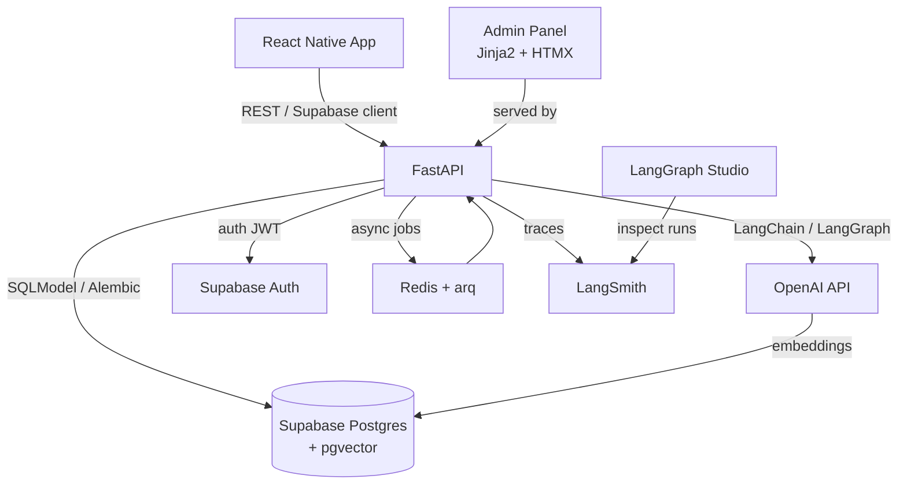

# Backend Tech Stack

## Database

| Tool | Role |
|---|---|
| **PostgreSQL** | Primary database |
| **Supabase** | Postgres hosting in production + built-in Auth, Storage, Realtime |
| **Supabase Docker** | Local development environment (full Supabase stack via Docker Compose) |
| **pgvector** | Postgres extension for storing and querying embedding vectors |

Supabase Docker spins up the same Postgres + PostgREST + Auth + Storage stack you get in production, so local and prod environments stay in sync.

---

## Backend API

| Tool | Role | Why |
|---|---|---|
| **FastAPI** | REST API framework | Python-native, async, fast, auto-generates OpenAPI docs |
| **SQLModel** | ORM / schema definitions | Combines SQLAlchemy + Pydantic; works great with FastAPI |
| **Alembic** | Database migrations | Standard migration tool for SQLAlchemy-based projects |
| **Pydantic v2** | Request/response validation | Already a FastAPI dependency, excellent for typed contracts |
| **uv** | Dependency management | Modern, fast Python package manager (replaces pip + venv) |

---

## AI Layer

| Tool | Role | Why |
|---|---|---|
| **LangChain** | LLM abstraction + tooling | Chains, prompts, retrieval, tool calling |
| **LangGraph** | Stateful AI agent workflows | Graph-based agent state machines; fits well for multi-step content generation (word → assign to rules → generate forms → generate sentences) |
| **LangSmith** | Tracing + observability | Logs every LLM call, token usage, latency, and intermediate steps; essential for debugging generation pipelines |
| **LangGraph Studio** | Visual agent debugger | Desktop app for visualizing and stepping through LangGraph runs; invaluable during agent development |
| **OpenAI API** | LLM + embeddings | GPT-4o for generation, `text-embedding-3-small` for vectors (configurable) |

LangGraph is a natural fit for the core content pipeline:

```
input: new base_word
  → classify word category
  → select matching grammar rules
  → generate word forms per rule row
  → match or generate sentences per form
  → generate and store embeddings
```

Each step is a graph node; the state carries the word and accumulated results through the pipeline.

---

## Admin Panel

A lightweight server-rendered admin UI served directly from the FastAPI app.

### Recommended template engine: Jinja2 + HTMX

| Tool | Role | Why |
|---|---|-
| **Jinja2** | HTML templating | Native FastAPI support via `Jinja2Templates`; no build step, no separate frontend project |
| **HTMX** | Interactivity without JS framework | Handles form submissions, partial page updates, and chat-like interfaces via HTML attributes; pairs perfectly with Jinja2 |
| **TailwindCSS** (CDN) | Styling | Drop-in via CDN, no npm required in the admin project |

This stack means the admin is just more FastAPI routes returning HTML — no separate deployment, no build pipeline, no CORS config.

---

### Admin pages

#### 1. AI Agent Chat — Content Generation
A chat interface where an admin converses with a LangGraph agent to:
- Add a new base word or expression
- Trigger rule classification and word form generation
- Review, approve, or correct generated forms
- Connect words/expressions to topics
- Generate or reassign sentences

The agent has tools backed by database read/write operations. HTMX handles the streaming chat UI with `hx-swap` on message arrival.

#### 2. Knowledge Graph Visualizer
An interactive diagram showing how words, expressions, sentences, topics, and grammar rules are connected.

**Recommended JS library: [Cytoscape.js](https://js.cytoscape.org/)**

| Why Cytoscape.js |
|---|
| Purpose-built for network/graph visualization (not charts) |
| Handles large node counts well |
| Multiple built-in layouts: force-directed, hierarchical, breadthfirst |
| Nodes and edges are fully styleable |
| Can filter/highlight by entity type (word, topic, rule…) |
| No React dependency — works directly in a Jinja2 template via CDN |

The page fetches a JSON graph payload from a FastAPI endpoint and renders it client-side. Clicking a node opens a detail panel (HTMX partial load).

#### 3. Registered Users
Standard CRUD admin page:
- List users from Supabase Auth
- View profile, registration date, activity
- Disable / delete accounts
Powered by the Supabase Management API or direct DB queries.

---

## Suggested additions

| Tool | Role | Why |
|---|---|---|
| **Supabase Auth** | User authentication | Already included in Supabase; JWT-based, works out of the box with FastAPI middleware |
| **Redis** (optional) | Task queue + caching | If AI generation jobs need to run async/background; use with `arq` or Celery |
| **arq** (optional) | Async background jobs | Lightweight Redis-based job queue; cleaner than Celery for Python async code |
| **pytest + httpx** | Testing | Standard FastAPI test setup |
| **Docker Compose** | Local orchestration | Wraps Supabase Docker + your FastAPI service + Redis in one `compose.yml` |

---

## Local Development Flow

```
docker compose up
  ├── supabase-db      (Postgres + pgvector)
  ├── supabase-studio  (DB admin UI at localhost:54323)
  ├── supabase-auth    (Auth service)
  ├── api              (FastAPI app, hot-reload)
  └── redis            (optional, for background jobs)
```

Migrations run via Alembic against the local Supabase Postgres instance. The same migration files deploy to the production Supabase project.

---

## Production Deployment

| Layer | Recommendation |
|---|---|
| API hosting | Railway, Render, or Fly.io (all support Python Docker images, simple deploys) |
| Database | Supabase cloud project (Pro plan for pgvector + larger storage) |
| AI jobs | Same API or a dedicated worker service on the same platform |

---

## Summary Diagram


