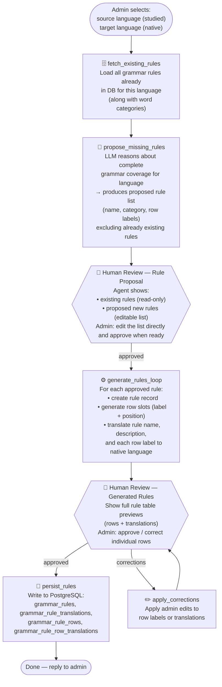

# Grammar Rule Setup Agent — Architecture

## Overview

A dedicated **LangGraph agent** for bootstrapping grammar rules for a language. The admin selects the **studied language** and their **native language** from dropdowns, then lets the agent drive: it fetches all existing rules from the database, reasons about what is missing for that language, proposes a gap-filling list, and negotiates with the admin until the list is approved. Only after approval does it generate and persist the full rule definitions — rows with labels in the studied language and translations in the native language.

---

## Agent Graph (LangGraph Nodes)



---

## Agent State Schema

```python
class GrammarRuleAgentState(TypedDict):
    # Input
    source_language_id: str               # Studied language (e.g. Spanish)
    source_language_name: str             # Human-readable, for LLM prompts
    target_language_id: str               # Native language (e.g. English)
    target_language_name: str

    # Context fetched from DB
    existing_rules: list[GrammarRuleSummary]   # {id, name, category, row_count}
    word_categories: list[WordCategory]        # {id, name, slug}

    # Proposal negotiation
    proposed_rules: list[RuleProposal]    # {name, description, category_id, rows: [{label, position}]}
    # Admin edits the proposed list directly in the UI before approval
    proposal_feedback: str | None         # (optional) freeform note of admin edits

    # Generated (post-approval)
    generated_rules: list[GeneratedRule]  # {rule: RuleProposal, translations: RuleTranslations,
                                          #  row_translations: list[RowTranslation]}
    corrections: str | None               # Admin edits applied before final persist

    # Control flow
    human_feedback: str | None
    awaiting_human: bool
    errors: list[str]
```

---

## Agent Tools

**Read tools**

| Tool | Description | DB Tables Touched |
|---|---|---|
| `get_existing_grammar_rules(language_id)` | Fetch all grammar rules for the language with their row counts and categories | `grammar_rules`, `grammar_rule_rows`, `word_categories` |
| `get_word_categories()` | Fetch the full list of word categories | `word_categories` |

**LLM tools**

| Tool | Description | DB Tables Touched |
|---|---|---|
| `propose_missing_rules(language, existing_rules, categories)` | LLM reasons about complete grammar coverage and returns a list of missing rules with rows | — (LLM call) |
| `revise_rule_proposal(current_proposal, feedback)` | (removed) Previously used for iterative revision loops; proposal is now edited directly by admin in the UI | — |
| `generate_rule_details(rule_proposal, source_lang, target_lang)` | LLM generates full rule description and translates rule name, description, and every row label into the target language | — (LLM call) |

**Persistence tools**

| Tool | Description | DB Tables Touched |
|---|---|---|
| `save_grammar_rule(name, description, language_id, category_id)` | Persist grammar rule record | `grammar_rules` |
| `save_grammar_rule_translation(rule_id, language_id, name, description)` | Persist translated rule name and description | `grammar_rule_translations` |
| `save_grammar_rule_rows(rule_id, rows)` | Persist all row slots for a rule | `grammar_rule_rows` |
| `save_grammar_rule_row_translations(row_id, language_id, label)` | Persist translated row labels | `grammar_rule_row_translations` |

---

## Example Conversation

```
Admin selects: Spanish (studied) → English (native)

  Agent: "Found 2 existing rules for Spanish:
          • AR Regular Present Tense (verb) — 6 rows
          • Definite Articles (adjective) — 4 rows

          Proposed new rules to add:
          1. ER Regular Present Tense       (verb)       — 6 rows
          2. IR Regular Present Tense       (verb)       — 6 rows
          3. Irregular Present Tense: SER   (verb)       — 6 rows
          4. Irregular Present Tense: ESTAR (verb)       — 6 rows
          5. Regular Preterite -AR          (verb)       — 6 rows
          6. Masculine/Feminine Nouns       (noun)       — 2 rows
          7. Indefinite Articles            (adjective)  — 4 rows

          Approve, or let me know what to add / remove / rename."

Admin: "remove 'Indefinite Articles', add 'Regular Imperfect -AR'"

  Agent: "Updated proposal:
          1–6 unchanged
          7. Regular Imperfect -AR (verb) — 6 rows
          Approve?"

Admin: "yes"

  Agent: "Generated 7 rules with row labels and English translations.
          Preview:

          ER Regular Present Tense
          Rows: Yo → I, Tú → You, Él/Ella → He/She,
                Nosotros → We, Vosotros → You (pl.), Ellos → They

          … (6 more rules)

          Approve all, or correct specific rows?"

Admin: "yes"

  Agent: "Done. 7 grammar rules saved with translations."
```

---

## What the LLM Knows About Grammar Coverage

The `propose_missing_rules` prompt gives the LLM:
- The target language name and a short typological description
- The existing rules list (names + categories)
- The full word category list
- Instruction to propose a **complete, coherent coverage set** — all major tense/aspect/mood paradigms for verbs, case/gender/number for nouns and adjectives, etc. — minus whatever already exists

This means the agent can be re-run as the language grows: it will only propose what is still missing.
