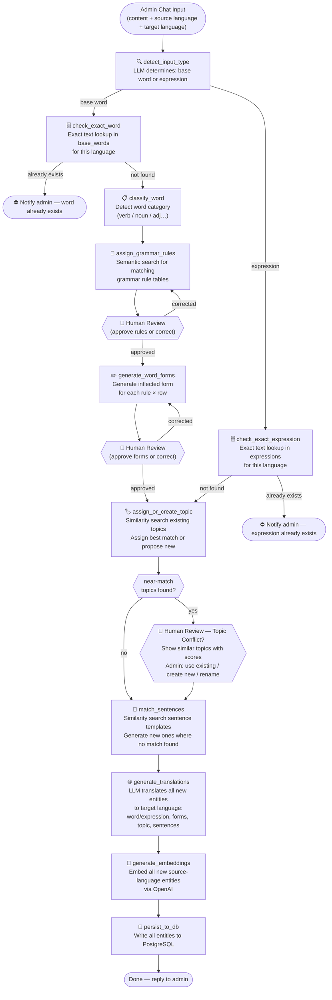
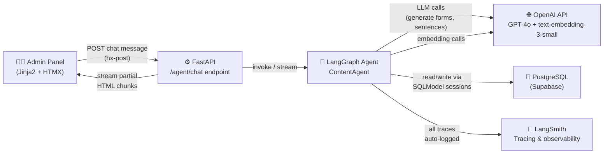

# AI Content Generation Agent — Architecture

## Overview

The agent is a **LangGraph stateful graph** driven by an admin chat interface. The admin provides the content (word or expression), the **source language** it belongs to (the language being studied, e.g. Spanish), and the **target language** to translate into (the learner's native language, e.g. English). The agent routes into one of two pipelines — **base word** or **expression** — before merging into a shared topic-assignment, sentence-matching, and translation stage. Every entity (word/expression, inflected forms, topic name, sentences) is translated into the target language before being persisted. The agent pauses for human review at key checkpoints.

---

## Agent Graph (LangGraph Nodes)



---

## Agent State Schema

The LangGraph state object that flows through every node:

```python
class ContentAgentState(TypedDict):
    # Input
    raw_input: str                        # Original admin message
    source_language_id: str               # Language of the content (e.g. Spanish)
    target_language_id: str               # Language to translate into (e.g. English)
    input_type: str | None                # "base_word" | "expression"

    # Base word — classification
    word_text: str | None                 # Canonical/base form (base word path only)
    word_category: str | None             # "verb" | "noun" | "adjective" | …

    # Base word — rule assignment
    candidate_rules: list[GrammarRule]    # Rules found by search/lookup
    confirmed_rules: list[GrammarRule]    # Rules approved by human

    # Base word — form generation
    generated_forms: list[WordFormDraft]  # {rule_id, row_id, form_text}
    confirmed_forms: list[WordFormDraft]  # Forms approved by human

    # Expression
    expression_text: str | None           # The expression text (expression path only)

    # Shared — topic assignment
    topic_candidates: list[TopicMatch]    # {id, name, similarity_score} from search
    topic_resolution: str | None          # "use_existing:<id>" | "create_new" | "rename:<text>"
    assigned_topic_id: str | None         # Final resolved topic UUID

    # Shared — sentence matching/generation
    sentence_assignments: list[SentenceAssignment]  # {entity_id, sentence_id}

    # Shared — translations
    translations: list[TranslationDraft]  # {entity_type, entity_id, field, translated_text}

    # Shared — embeddings
    embeddings: list[EmbeddingRecord]     # {entity_type, entity_id, vector}

    # Control flow
    human_feedback: str | None            # Latest message from admin
    awaiting_human: bool                  # Pause flag for HTMX chat
    errors: list[str]                     # Non-fatal issues accumulated
```

---

## Agent Tools

**Duplicate / existence checks** (exact match only for words and expressions)

| Tool | Description | DB Tables Touched |
|---|---|---|
| `lookup_exact_base_word(text, language_id)` | Exact text lookup; returns existing record or `None` | `base_words` |
| `lookup_exact_expression(text, language_id)` | Exact text lookup; returns existing record or `None` | `expressions` |

**Similarity retrievers** (used for topics and sentences only)

| Tool | Description | DB Tables Touched |
|---|---|---|
| `find_similar_topics(text, language_id, threshold)` | Cosine similarity search for near-duplicate topics; returns candidates with scores | `topics`, `entity_embeddings` |
| `search_sentences(entity_text, category, rule_id?)` | Similarity search for reusable sentence templates; returns ranked matches | `sentences`, `entity_embeddings` |

**Grammar rule tools** (base word path only)

| Tool | Description | DB Tables Touched |
|---|---|---|
| `search_grammar_rules(text, language_id)` | Semantic vector search for matching grammar rule tables | `grammar_rules`, `entity_embeddings` |
| `get_grammar_rule_rows(rule_id)` | Fetch all row slots of a rule table | `grammar_rule_rows` |
| `generate_word_forms(word, rule, rows)` | LLM call to produce inflected forms for each row | — (LLM call) |

**Generation and translation tools**

| Tool | Description | DB Tables Touched |
|---|---|---|
| `generate_sentence(entity_text, category, rule_id?)` | LLM call to create a new sentence template | — (LLM call) |
| `translate_entities(entities, source_lang, target_lang)` | LLM call (batch) to translate word/expression text, inflected forms, topic name, and sentence templates into the target language | — (LLM call) |
| `embed_text(texts)` | Batch embed source-language strings via OpenAI embeddings API | — (OpenAI call) |

**Persistence tools**

| Tool | Description | DB Tables Touched |
|---|---|---|
| `save_base_word(word, source_lang, translation, target_lang, category)` | Persist base word + its translation | `base_words`, `word_translations` |
| `save_expression(text, source_lang, translation, target_lang)` | Persist expression + its translation | `expressions`, `expression_translations` |
| `save_word_rule_assignments(word_id, rule_ids)` | Link word to grammar rules | `word_rule_assignments` |
| `save_word_forms(forms, translations)` | Persist inflected forms + their translations | `word_forms`, `word_form_translations` |
| `save_topic(name, source_lang, translation, target_lang)` | Create new topic + its translation | `topics`, `topic_translations` |
| `save_base_word_topic(word_id, topic_id)` | Tag base word with topic | `base_word_topics` |
| `save_expression_topic(expression_id, topic_id)` | Tag expression with topic | `expression_topics` |
| `save_sentences(sentences, translations)` | Persist sentence templates + their translations | `sentences`, `sentence_translations` |
| `save_word_form_sentences(assignments)` | Link word forms to sentences | `word_form_sentences` |
| `save_embeddings(records)` | Store all embedding vectors | `entity_embeddings` |

---

## System Interaction Diagram



---

## Human-in-the-Loop Pattern

The agent uses LangGraph's `interrupt` mechanism: the graph suspends, the state is checkpointed, and the agent waits for the next admin message before resuming.

### Checkpoints by path

**Base word path** — up to 3 interrupts:
1. *(hard stop)* Exact word exists → notify and abort. No interrupt needed.
2. **After rule assignment** — shows matched grammar rule tables; admin confirms or corrects before any forms are generated.
3. **After form generation** — shows preview table of all inflected forms; admin approves or edits before anything is written.
4. *(conditional)* **Topic conflict** — if similarity search finds near-matching topics, shows candidates with scores; admin picks one, creates new, or renames.

**Expression path** — up to 1 interrupt:
1. *(hard stop)* Exact expression exists → notify and abort.
2. *(conditional)* **Topic conflict** — same as above.

### Example conversations

**Base word — no conflicts:**
```
Admin: "add the verb bailar, Spanish → English"
  Agent: "No existing word found. Classified as: verb.
          Matched rules: AR Regular Present Tense. Confirm?"
Admin: "yes"
  Agent: "Generated forms: bailo, bailas, baila, bailamos, bailáis, bailan.
          Topic: assigned to 'Music & Dance' (existing). Approve all?"
Admin: "yes"
  Agent: "Translations generated for word, 6 forms, topic, and 6 sentences.
          Done. bailar saved with all translations."
```

**Expression — topic conflict:**
```
Admin: "add the expression buenos días, Spanish → English"
  Agent: "No existing expression found.
          ⚠️ Topic near-matches: 'Greetings' (0.91), 'Daily Phrases' (0.87).
          Use one of these or create a new topic?"
Admin: "use Greetings"
  Agent: "Translations generated for expression and 2 sentences.
          Done. buenos días saved and tagged under 'Greetings'."
```

### Topic Similarity Thresholds

| Range | Meaning | Action |
|---|---|---|
| ≥ 0.95 | Effectively the same topic | Auto-assign, no interrupt |
| 0.80 – 0.95 | Suspicious near-match | Interrupt — show candidates, ask admin |
| < 0.80 | Clearly distinct | Create new topic silently |
